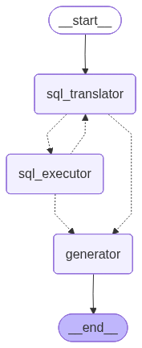

# SQL Agent
The SQL Agent simulates a banking-style AI assistant. When a user asks to check their balance or review recent transactions for their account, this agent translates that natural language request into SQL, runs it against your database, and returns the results in a human-friendly format.

## Overview


The workflow is roughly
1. **sql_translator**: converts user query → SQL  
2. **sql_executor**: runs SQL on the database  
3. **generator**: refines or formats the output  
4. The graph returns the final result

---

## Tech Stack & Tools

## Tech stack
- **Python:** 3.13
- **Poetry:** dependency & virtualenv management
- **LangChain / LangGraph:** LLM orchestration and graph nodes
- **psycopg:** async PostgreSQL client
- **Pydantic / TypedDict:** structured output and state modeling
- **Jupyter Notebook:** demo development
- **FastAPI：** Python web framework for building APIs

## Prerequisites
- Python 3.9 or later (3.13 recommended)
- Poetry installed: https://python-poetry.org/
- PostgreSQL database credentials
- Azure Open AI credentials (if using LLM)

## Environment variables
```
AZURE_OPENAI_API_KEY=
AZURE_OPENAI_ENDPOINT=
AZURE_OPENAI_DEPLOYMENT=
AZURE_OPENAI_API_VERSION=

POSTGRES_USER = 
POSTGRES_PASSWORD = 
POSTGRES_SERVER = 
POSTGRES_PORT = 
POSTGRES_DB = 
```

## Database Setup
1. Install pgAdmin4 application (If haven't)
2. Open pgAdmin4 application
2. Create ``transactions`` table in pgAdmin4 application
```sql
CREATE TABLE transactions (
    clnt_id INTEGER,
    bank_id INTEGER,
    acc_id INTEGER,
    txn_id TEXT,
    txn_date TIMESTAMP,
    description TEXT,
    amt NUMERIC(14,2),
    cat VARCHAR(100),
    merchant VARCHAR(255)
);
```
3. Import data from `data.csv` into `transactions` table


## Installation
1. Clone the repository:
     ```bash
     git clone https://github.com/jl0703/sql-agent.git
     cd sql-agent
     ```

2. Install dependencies (using [Poetry](https://python-poetry.org/)):
     ```bash
     poetry env use python
     poetry install
     ```

## Run in Jupyter notebook (notebooks/main.ipynb)
- In section **5.6 Graph invocation**, run the cell like:
    ```python
    await build_graph().ainvoke(
        {
            "client_id": 1, 
            "query": "How much did I spend in 2023?",
        }
    )
    ```
- The notebook shows example queries and printed responses (see cells near the end of the notebook).

## Run in FastAPI
- Run with uvicorn to start:
    ```powershell
    poetry run uvicorn app.main:app --reload       
    ```
- Navigate to http://localhost:8000/docs
- Select ``[POST]/transactions/query`` endpoint
- Provide input like format below:
    ```json
    {
    "client_id": "1",
    "query": "How much did i spent in 2023?"
    }
    ```